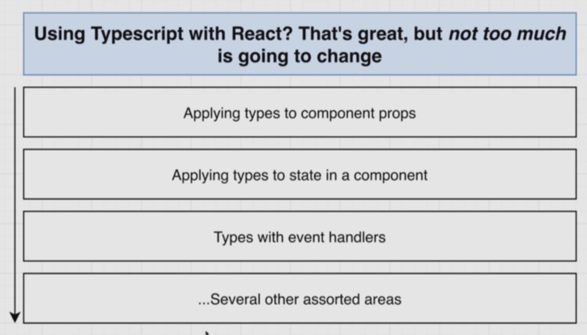
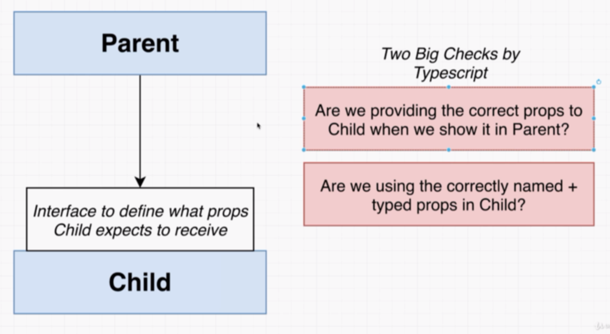

# React-TypeScript


- [React-TypeScript](#react-typescript)
  - [Types Around Props and State](#types-around-props-and-state)
    - [1. Changes with TypeScript](#1-changes-with-typescript)
    - [2. The Big Difference with Props](#2-the-big-difference-with-props)
    - [3. Explicit Component Type Annotations](#3-explicit-component-type-annotations)
    - [4. Annotations with Children](#4-annotations-with-children)
    - [5. State with TypeScript](#5-state-with-typescript)
    - [6. Type Inference with State](#6-type-inference-with-state)
    - [7. Quick Finish to the Example](#7-quick-finish-to-the-example)
    - [8. More on State](#8-more-on-state)
    - [9. Type Unions in State](#9-type-unions-in-state)


## Types Around Props and State

### 1. Changes with TypeScript



there are several ways of adding props type to a react component

### 2. The Big Difference with Props
Child
```tsx
interface ChildProps {
    color:string;
}
export const Child = ({color}:ChildProps)=>(
    <div>
        <div>{color}</div>
        <button ></button>
    </div>
)
```
Parent
```tsx
import {ChildAsFC} from './child'
const Parent = ()=>{
    return(
        <ChildAsFC color='red' >
            this is children
        </ChildAsFC>
    )
}

export default Parent;
```
### 3. Explicit Component Type Annotations

let's check the second way
```tsx

export const ChildAsFC:React.FC<ChildProps>=({color,onClick})=>{
  return    <div>
        <div>{color}</div>
        <button onClick={onClick} ></button>
    </div>
}
```
there are few benefits to doing the types


### 4. Annotations with Children
### 5. State with TypeScript
### 6. Type Inference with State
### 7. Quick Finish to the Example
### 8. More on State
### 9. Type Unions in State

2. The Big Difference with Props


Child
```tsx
import React from "react"

interface ChildProps {
    color:string;
    onClick:()=>void
}
export const Child = ({color,onClick}:ChildProps)=>(
    <div>
        <div>{color}</div>
        <button onClick={onClick} ></button>
    </div>
)

export const ChildAsFC:React.FC<ChildProps>=({color,onClick})=>{
    return    <div>
        <div>{color}</div>
        <button onClick={onClick} ></button>
    </div>
}


```

Parent


```tsx
import {ChildAsFC} from './child'
const Parent = ()=>{
    return(
        <ChildAsFC onClick={()=>{console.log(
            "clicked"
        );
        }} color='red' >
            this is children
        </ChildAsFC>
    )
}

export default Parent;
```
```tsx

```
```tsx

```

