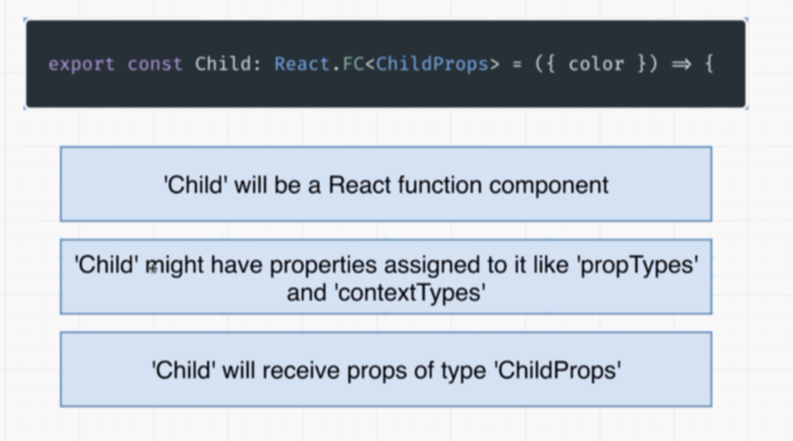
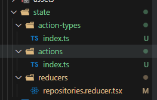

# React-TypeScript


- [React-TypeScript](#react-typescript)
  - [Types Around Props and State](#types-around-props-and-state)
    - [1. Changes with TypeScript](#1-changes-with-typescript)
    - [2. The Big Difference with Props](#2-the-big-difference-with-props)
    - [3. Explicit Component Type Annotations](#3-explicit-component-type-annotations)
    - [4. Annotations with Children](#4-annotations-with-children)
    - [5. State with TypeScript](#5-state-with-typescript)
    - [6. Type Inference with State](#6-type-inference-with-state)
    - [7. Quick Finish to the Example](#7-quick-finish-to-the-example)
    - [8. More on State](#8-more-on-state)
  - [Types Around Events and Refs](#types-around-events-and-refs)
    - [1. Inline Event Handlers](#1-inline-event-handlers)
    - [2. Typing Standalone Event Handlers](#2-typing-standalone-event-handlers)
    - [3. Handling Drag Events Too!](#3-handling-drag-events-too)
    - [4. TypeScript with Class Components](#4-typescript-with-class-components)
    - [5. Applying Types to Refs](#5-applying-types-to-refs)
    - [6. More on Refs](#6-more-on-refs)
  - [Typescript with Redux](#typescript-with-redux)
    - [1. App Overview](#1-app-overview)
    - [2. Project Setup](#2-project-setup)
    - [3. Redux Store Design](#3-redux-store-design)
    - [4. Reducer Setup](#4-reducer-setup)
    - [5. Annotating the Return Type](#5-annotating-the-return-type)
    - [6. Typing an Action](#6-typing-an-action)
    - [7. Separate Interfaces for Actions](#7-separate-interfaces-for-actions)
    - [8. Applying Action Interfaces](#8-applying-action-interfaces)
    - [9. Adding an Action Type Enum](#9-adding-an-action-type-enum)
    - [10. A Better Way to Organize Code](#10-a-better-way-to-organize-code)
    - [11. Adding Action Creators](#11-adding-action-creators)
    - [12. Adding Request Logic](#12-adding-request-logic)
    - [13. Applying Typings to Dispatch](#13-applying-typings-to-dispatch)
    - [14. Setting Up Exports](#14-setting-up-exports)
    - [15. Wiring Up to React](#15-wiring-up-to-react)
    - [16. Oops... Initial State!](#16-oops-initial-state)
    - [17. Reminder on Event Types](#17-reminder-on-event-types)
    - [18. Calling an Action Creator](#18-calling-an-action-creator)
    - [19. Binding Action Creators](#19-binding-action-creators)
    - [20. Selecting State](#20-selecting-state)
    - [21. Awkward Typings Around React-Redux](#21-awkward-typings-around-react-redux)
    - [22. Creating a Typed Selector](#22-creating-a-typed-selector)
    - [23. Consuming Store State](#23-consuming-store-state)
    - [24. Quick Wrapup](#24-quick-wrapup)
  - [The Big App - Here's What We're Building!](#the-big-app---heres-what-were-building)
    - [1. App Overview](#1-app-overview-1)
    - [2. Three Big Challenges](#2-three-big-challenges)
  - [Code Transpiling in the Browser](#code-transpiling-in-the-browser)
    - [1. Transpiling Options](#1-transpiling-options)
    - [2. Remote Transpiling.mp4](#2-remote-transpilingmp4)
    - [3. Module Systems](#3-module-systems)
    - [4. Behind the Scenes with Webpack](#4-behind-the-scenes-with-webpack)
    - [5. Webpack with ES Modules](#5-webpack-with-es-modules)
    - [6. One Small Change](#6-one-small-change)
    - [7. Options for Bundling](#7-options-for-bundling)
    - [8. So Which Approach](#8-so-which-approach)
    - [9. A Webpack Replacement](#9-a-webpack-replacement)
  - [Implementing In-Browser Bundling](#implementing-in-browser-bundling)
    - [1. A Demo App](#1-a-demo-app)
    - [2. Project Setup](#2-project-setup-1)
    - [3. Basic Form Elements](#3-basic-form-elements)
    - [4. Understanding ESBuild](#4-understanding-esbuild)
    - [5. Initializing ESBuild](#5-initializing-esbuild)
    - [6. Using Refs for Arbitrary Values](#6-using-refs-for-arbitrary-values)
    - [7. Transpiling Works!](#7-transpiling-works)
    - [8. Troubles with Bundling in the Browser](#8-troubles-with-bundling-in-the-browser)
    - [9. Issues with NPM](#9-issues-with-npm)
    - [10. Solution with Unpkg](#10-solution-with-unpkg)
    - [11. Demo ESBuild Plugin](#11-demo-esbuild-plugin)
    - [12. ESBuild Can Bundle!](#12-esbuild-can-bundle)
    - [13. Deep Dive on Bundling](#13-deep-dive-on-bundling)
    - [14. Filters and Namespaces](#14-filters-and-namespaces)
    - [15. Adding a Tiny Test Package](#15-adding-a-tiny-test-package)
  - [Dynamic Fetching and Loading of NPM Modules](#dynamic-fetching-and-loading-of-npm-modules)
    - [1. Dynamically Fetching Modules](#1-dynamically-fetching-modules)
    - [2. Generating the Unpkg URL](#2-generating-the-unpkg-url)
    - [3. Issues with Multi-File Packages](#3-issues-with-multi-file-packages)
    - [4. Solving Relative Paths](#4-solving-relative-paths)
    - [5. Using the URL Constructor](#5-using-the-url-constructor)
    - [6. Failing Nested Requires](#6-failing-nested-requires)
    - [7. Resolving Nested Paths](#7-resolving-nested-paths)
    - [8. It Works!](#8-it-works)
    - [9. Defines During Bundling](#9-defines-during-bundling)
    - [10. Bonus! Package Versioning](#10-bonus-package-versioning)
  - [Caching For Big Performance Gains](#caching-for-big-performance-gains)
    - [1. Crazy Numbers of Requests](#1-crazy-numbers-of-requests)
    - [2. Implementing a Caching Layer](#2-implementing-a-caching-layer)
    - [3. Caching with Key-Value Pairs](#3-caching-with-key-value-pairs)
    - [4. Fixing a TypeScript Error](#4-fixing-a-typescript-error)
    - [5. Bundling User Input](#5-bundling-user-input)
    - [6. Breaking Up Resolve Logic With Filters](#6-breaking-up-resolve-logic-with-filters)
    - [7. Refactoring to Multiple Plugins](#7-refactoring-to-multiple-plugins)
    - [8. Loading CSS Files](#8-loading-css-files)
    - [9. Configuring the Correct Loader](#9-configuring-the-correct-loader)
    - [10. Small Shortcoming with ESBuild](#10-small-shortcoming-with-esbuild)
    - [11. Tricking ESBuild's CSS Handling](#11-tricking-esbuilds-css-handling)
    - [12. Escaping CSS Snippets](#12-escaping-css-snippets)
    - [13. Separate Load Filters](#13-separate-load-filters)
    - [14. Extracting Common Caching Logic](#14-extracting-common-caching-logic)
    - [15. A Better Way of Loading WASM](#15-a-better-way-of-loading-wasm)
  - [Safely Handling Untrusted Code Execution](#safely-handling-untrusted-code-execution)
    - [1. Executing User Code](#1-executing-user-code)
    - [2. Big Issues with Code Execution](#2-big-issues-with-code-execution)
    - [3. How Do Others Solve This](#3-how-do-others-solve-this)
    - [4. Displaying IFrames](#4-displaying-iframes)
    - [5. Different Execution Context](#5-different-execution-context)
    - [6. Crossing Context](#6-crossing-context)
    - [7. Sandboxing an IFrame](#7-sandboxing-an-iframe)
    - [8. Breaking Access with Different Domains](#8-breaking-access-with-different-domains)
    - [9. How Do IFrames Fix Anything](#9-how-do-iframes-fix-anything)
    - [10. The Full Flow - How CodePen and CodeSandbox Work](#10-the-full-flow---how-codepen-and-codesandbox-work)
    - [11. Do We Need Separation](#11-do-we-need-separation)
    - [12. Middle Ground Approach](#12-middle-ground-approach)
    - [13. IFrames with SrcDocs](#13-iframes-with-srcdocs)
    - [14. Execution Using SrcDoc](#14-execution-using-srcdoc)
    - [15. Running Unescaped Code](#15-running-unescaped-code)
    - [16. Indirect Communication Between Frames](#16-indirect-communication-between-frames)
    - [17. Passing Code to the IFrame](#17-passing-code-to-the-iframe)
    - [18. It Works!](#18-it-works)
    - [19. Highlighting Errors](#19-highlighting-errors)
    - [20. Issues with Repeat Execution](#20-issues-with-repeat-execution)
    - [21. Resetting the IFrame Contents](#21-resetting-the-iframe-contents)
    - [22. Warning Fixup](#22-warning-fixup)
  - [Displaying a Code Editor In a React App](#displaying-a-code-editor-in-a-react-app)
    - [1. Issues with Eager Bundling](#1-issues-with-eager-bundling)
    - [2. Quick Revert](#2-quick-revert)
    - [3. Open Source Editor Options](#3-open-source-editor-options)
    - [4. Displaying an Editor](#4-displaying-an-editor)
    - [5. Configuring the Editor](#5-configuring-the-editor)
    - [6. Crazy Monaco Editor Type Defs](#6-crazy-monaco-editor-type-defs)
    - [7. A Few More Options](#7-a-few-more-options)
    - [8. Setting the Initial Value](#8-setting-the-initial-value)
    - [9. Handling Editor Change Events](#9-handling-editor-change-events)
    - [10. Adding a Type Definition](#10-adding-a-type-definition)
    - [11. Adding Prettier to Our Editor](#11-adding-prettier-to-our-editor)
    - [12. Automatic Code Formatting](#12-automatic-code-formatting)
    - [13. Adding a CSS Library](#13-adding-a-css-library)
    - [14. Floating the Format Button](#14-floating-the-format-button)
    - [15. Fixing Syntax Highlighting](#15-fixing-syntax-highlighting)
    - [](#)
    - [](#-1)
    - [](#-2)
    - [](#-3)
    - [](#-4)
    - [](#-5)
    - [](#-6)
    - [](#-7)
    - [](#-8)
    - [](#-9)
    - [](#-10)
    - [](#-11)
    - [](#-12)
    - [](#-13)
    - [](#-14)
    - [](#-15)
    - [](#-16)
    - [](#-17)
    - [](#-18)
    - [](#-19)
    - [](#-20)
    - [](#-21)
    - [](#-22)
    - [](#-23)
    - [](#-24)
    - [](#-25)
    - [](#-26)
    - [](#-27)
    - [](#-28)
    - [](#-29)
    - [](#-30)
    - [](#-31)
    - [](#-32)
    - [](#-33)
    - [](#-34)
    - [](#-35)
    - [](#-36)
    - [](#-37)
    - [](#-38)
    - [](#-39)
    - [](#-40)
    - [](#-41)
    - [](#-42)
    - [](#-43)
    - [](#-44)
    - [](#-45)
    - [](#-46)
    - [](#-47)
    - [](#-48)
    - [](#-49)
    - [](#-50)
    - [](#-51)
    - [](#-52)
    - [](#-53)
    - [](#-54)
    - [](#-55)
    - [](#-56)
    - [](#-57)
    - [](#-58)
    - [](#-59)


## Types Around Props and State

### 1. Changes with TypeScript


there are several ways of adding props type to a react component

### 2. The Big Difference with Props
Child
```tsx
interface ChildProps {
    color:string;
}
export const Child = ({color}:ChildProps)=>(
    <div>
        <div>{color}</div>
        <button ></button>
    </div>
)
```
Parent
```tsx
import {ChildAsFC} from './child'
const Parent = ()=>{
    return(
        <ChildAsFC color='red' >
            this is children
        </ChildAsFC>
    )
}

export default Parent;
```
### 3. Explicit Component Type Annotations

let's check the second way
```tsx

export const ChildAsFC:React.FC<ChildProps>=({color,onClick})=>{
  return    <div>
        <div>{color}</div>
        <button onClick={onClick} ></button>
    </div>
}
```
there are few benefits to doing the types



### 4. Annotations with Children
let's add a function to the interface and Component

Child
```tsx
import React from "react"

interface ChildProps {
    color:string;
    onClick:()=>void
}
export const Child = ({color,onClick}:ChildProps)=>(
    <div>
        <div>{color}</div>
        <button onClick={onClick} ></button>
    </div>
)

export const ChildAsFC:React.FC<ChildProps>=({color,onClick})=>{
    return    <div>
        <div>{color}</div>
        <button onClick={onClick} ></button>
    </div>
}


```
Parent

```tsx
import {ChildAsFC} from './child'
const Parent = ()=>{
    return(
        <ChildAsFC onClick={()=>{console.log(
            "clicked"
        );
        }} color='red' >
            this is children
        </ChildAsFC>
    )
}

export default Parent;
```
### 5. State with TypeScript
sample project we are going to build

### 6. Type Inference with State
### 7. Quick Finish to the Example
we have to add type to useState if the initial value will not help to infer the type
```tsx
const [guestList,setGuestList] = useState<string[]>([])
```

### 8. More on State
we are going to add this functionality


```tsx
import { useState } from "react";
import {
  CustomButton,
  CustomInput,
  ErrorContainer,
  Header,
  ListContainer,
  Wrapper,
} from "./guest-list.styles";
// user data
export const usersData = [
  {
    name: "a",
    age: 20,
  },
  {
    name: "b",
    age: 20,
  },
  {
    name: "c",
    age: 20,
  },
  {
    name: "d",
    age: 20,
  },
];
const FindUser: React.FC = () => {
  const [name, setName] = useState("");
  const [user, setUser] = useState<{ name: string; age: number } | undefined>();
  const onClick = () => {
    console.log(name);

    const foundUser = usersData.find(
      (user) => user.name === name.toLowerCase()
    );
    console.log(foundUser);

    setUser(foundUser);
  };

  return (
    <Wrapper>
      <Header>Find User</Header>
      <CustomInput value={name} onChange={(e) => setName(e.target.value)} />
      <CustomButton onClick={onClick}>find user</CustomButton>

      <ListContainer>
        {user !== undefined ? (
          <>
            <li>name : {user.name}</li>
            <li>age : {user.age}</li>
          </>
        ) : (
          <ErrorContainer>canto find the specified user</ErrorContainer>
        )}
      </ListContainer>
    </Wrapper>
  );
};

export default FindUser;
```


## Types Around Events and Refs
### 1. Inline Event Handlers
we don't get any issue when we develop event handlers with inline functions.
but when we separate them issues come.

```tsx

import React from "react";
import { CustomInput, Header, Wrapper } from "../state/guest-list.styles";

const EventHandler: React.FC = () => {
  const onChange = (event) => {
    console.log(event);
  };

  const onDragStart = (event: React.DragEvent<HTMLDivElement>) => {
    console.log("dragging");
  };
  return (
    <Wrapper>
      <Header>Event handler in react-typescript</Header>
      <CustomInput onChange={onChange} />
      <div draggable onDragStart={onDragStart}>
        Drag me !
      </div>
    </Wrapper>
  );
};

export default EventHandler;
```
here we get an error


### 2. Typing Standalone Event Handlers

```tsx
  const onChange = (event:React.ChangeEvent<HTMLInputElement>) => {
    console.log(event);
  };
```
here we are adding the event type to the handler function.  
### 3. Handling Drag Events Too!

there are other events to 

```tsx
  const onDragStart = (event: React.DragEvent<HTMLDivElement>) => {
    console.log("dragging");
  };

```


so we can get all the elements for a drag event


### 4. TypeScript with Class Components

```tsx
import { Component, ReactNode } from "react";
import {
  CustomButton,
  CustomInput,
  ErrorContainer,
  ListContainer,
  Wrapper,
  Header,
} from "../state/guest-list.styles";

interface User {
  name: string;
  age: number;
}

interface UserSearchProps {
  users: User[];
}

interface UserSearchState {
  name: string;
  user: User | undefined;
}

class UserSearch extends Component<UserSearchProps> {
  state: UserSearchState = {
    name: "",
    user: undefined,
  };

  onClick = () => {
    const foundUser = this.props.users.find(
      (user) => user.name === this.state.name.toLowerCase()
    );
    this.setState({ user: foundUser });
  };

  render(): ReactNode {
    const { name, user } = this.state;
    return (
      <Wrapper>
        <Header>Find User</Header>
        <CustomInput
          value={name}
          onChange={(e) =>
            this.setState({
              name: e.target.value,
            })
          }
        />
        <CustomButton onClick={this.onClick}>find user</CustomButton>

        <ListContainer>
          {user !== undefined ? (
            <>
              <li>name : {user.name}</li>
              <li>age : {user.age}</li>
            </>
          ) : (
            <ErrorContainer>canto find the specified user</ErrorContainer>
          )}
        </ListContainer>
      </Wrapper>
    );
  }
}

export default UserSearch;

```

### 5. Applying Types to Refs
```tsx
import React, { useState, useRef, useEffect } from "react";
import {
  CustomButton,
  CustomInput,
  ErrorContainer,
  Header,
  ListContainer,
  Wrapper,
} from "../state/guest-list.styles";
export const usersData = [
  {
    name: "a",
    age: 20,
  },
  {
    name: "b",
    age: 20,
  },
  {
    name: "c",
    age: 20,
  },
  {
    name: "d",
    age: 20,
  },
];
const FindUserWithRef: React.FC = () => {
  const [name, setName] = useState("");
  const [user, setUser] = useState<{ name: string; age: number } | undefined>();
  const [hasError, setHasError] = useState(false);

// Here we are adding null to the type because if we don't assign the ref to a value it will be null. 
  const inputRef = useRef<HTMLInputElement | null>(null);
  const onClick = () => {
    const foundUser = usersData.find(
      (user) => user.name === name.toLowerCase()
    );
    if (!foundUser) {
      setHasError(true);
    } else {
      setHasError(false);
    }

    setUser(foundUser);
  };

  useEffect(() => {
    if (!inputRef.current) return;
    inputRef.current.focus();
    return;
  }, []);

  const onChange = (event: React.ChangeEvent<HTMLInputElement>) => {
    setName(event.target.value);
    if (!event.target.value) {
      setHasError(false);
      setUser(undefined);
    }
  };
  return (
    <Wrapper>
      <Header>Find User</Header>
      <CustomInput ref={inputRef} value={name} onChange={onChange} />
      <CustomButton onClick={onClick}>find user</CustomButton>

      <ListContainer>
        {user !== undefined ? (
          <>
            <li>name : {user.name}</li>
            <li>age : {user.age}</li>
          </>
        ) : hasError ? (
          <ErrorContainer>canto find the specified user</ErrorContainer>
        ) : null}
      </ListContainer>
    </Wrapper>
  );
};

export default FindUserWithRef;
```
### 6. More on Refs

```tsx
// here we are adding a type guard to the ref
  useEffect(() => {
    if (!inputRef.current) return;
    inputRef.current.focus();
    return;
  }, []);
```


## Typescript with Redux
### 1. App Overview

### 2. Project Setup
let's create a vite app with typescript and react
```bash
npm create vite@latest
```
then install the dependencies

```bash
npm i redux react-redux axios redux-thunk
```
and the types 

### 3. Redux Store Design


this is our redux store


our actions and action creators


folder structure


we are going to use a single file


### 4. Reducer Setup
let's create the first reducer
```tsx
interface RepositoryState {
  loading: boolean;
  error: string | null;
  data: string[];
}

interface action {
  type: string;
  payload: any;
}

const reducer = (state: RepositoryState, action: any): RepositoryState => {
  switch (action.type) {
    case "search_repositories_start":
      return {
        error: null,
        data: [],
        loading: true,
      };
    case "search_repositories_success":
      return {
        error: null,
        data: action.payload,
        loading: false,
      };
    case "search_repositories_failure":
      return {
        error: action.payload,
        data: [],
        loading: false,
      };

    default:
      return state;
  }
};

export default reducer;

```
### 5. Annotating the Return Type
```tsx
//  here we are adding the return type of the function
const reducer = (state: RepositoryState, action: any): RepositoryState => {
```
### 6. Typing an Action

here we are adding the type for actions
```tsx
interface Action {
  type: string;
  payload?: any;
}

const reducer = (state: RepositoryState, action: Action): RepositoryState => {
```
### 7. Separate Interfaces for Actions

our reducer


```tsx
interface SearchRepositoryStartAction {
  type:'search_repositories_start',
}

interface SearchRepositorySuccessAction {
  type:'search_repositories_success',
  payload:string[]
  
}
interface SearchRepositoryErrorAction {
  type:'search_repositories_failure',
  payload:string
  
}
```
### 8. Applying Action Interfaces
let's add the types to the reducer
```tsx
const reducer = (
  state: RepositoryState,
  action:
    
): RepositoryState => {
```
### 9. Adding an Action Type Enum
```tsx
type Action =
  | SearchRepositoryStartAction
  | SearchRepositorySuccessAction
  | SearchRepositoryErrorAction;

interface SearchRepositoryStartAction {
  type: ActionTypes.SEARCH_REPOSITORY_START;
}

interface SearchRepositorySuccessAction {
  type: ActionTypes.SEARCH_REPOSITORY_SUCCESS;
  payload: string[];
}
interface SearchRepositoryErrorAction {
  type: ActionTypes.SEARCH_REPOSITORY_ERROR;
  payload: string;
}

enum ActionTypes {
  SEARCH_REPOSITORY_START = "search_repositories_start",
  SEARCH_REPOSITORY_SUCCESS = "search_repositories_success",
  SEARCH_REPOSITORY_ERROR = "search_repositories_error",
}
const reducer = (state: RepositoryState, action: Action): RepositoryState => {
  switch (action.type) {
    case ActionTypes.SEARCH_REPOSITORY_START:
      return {
        error: null,
        data: [],
        loading: true,
      };
    case ActionTypes.SEARCH_REPOSITORY_SUCCESS:
      return {
        error: null,
        data: action.payload,
        loading: false,
      };
    case ActionTypes.SEARCH_REPOSITORY_ERROR:
      return {
        ........... rest of the code
```
### 10. A Better Way to Organize Code

folder structure


let's cleanup the folder structure

📂 repositories.reducer.tsx
```tsx
import { ActionTypes } from "../action-types";
import { Action } from "../actions";

interface RepositoryState {
  loading: boolean;
  error: string | null;
  data: string[];
}

const reducer = (state: RepositoryState, action: Action): RepositoryState => {
  switch (action.type) {
    case ActionTypes.SEARCH_REPOSITORY_START:
      return {
        error: null,
        data: [],
        loading: true,
      };
    case ActionTypes.SEARCH_REPOSITORY_SUCCESS:
      return {
        error: null,
        data: action.payload,
        loading: false,
      };
    case ActionTypes.SEARCH_REPOSITORY_ERROR:
      return {
        error: action.payload,
        data: [],
        loading: false,
      };

    default:
      return state;
  }
};

export default reducer;

```

📂 **vite-typescript-redux\src\state\actions-types\index.ts**
```tsx
import { ActionTypes } from "../action-types";

export type Action =
  | SearchRepositoryStartAction
  | SearchRepositorySuccessAction
  | SearchRepositoryErrorAction;

interface SearchRepositoryStartAction {
  type: ActionTypes.SEARCH_REPOSITORY_START;
}

interface SearchRepositorySuccessAction {
  type: ActionTypes.SEARCH_REPOSITORY_SUCCESS;
  payload: string[];
}
interface SearchRepositoryErrorAction {
  type: ActionTypes.SEARCH_REPOSITORY_ERROR;
  payload: string;
}

```

📂 [**vite-typescript-redux\src\state\reducers\repositories.reducer.tsx**](./vite-typescript-redux/src/state/reducers/repositories.reducer.tsx)
```tsx
export enum ActionTypes {
  SEARCH_REPOSITORY_START = "search_repositories_start",
  SEARCH_REPOSITORY_SUCCESS = "search_repositories_success",
  SEARCH_REPOSITORY_ERROR = "search_repositories_error",
}

```

### 11. Adding Action Creators
### 12. Adding Request Logic
### 13. Applying Typings to Dispatch
### 14. Setting Up Exports
### 15. Wiring Up to React
### 16. Oops... Initial State!
### 17. Reminder on Event Types
### 18. Calling an Action Creator
### 19. Binding Action Creators
### 20. Selecting State
### 21. Awkward Typings Around React-Redux
### 22. Creating a Typed Selector
### 23. Consuming Store State
### 24. Quick Wrapup

## The Big App - Here's What We're Building!
### 1. App Overview
### 2. Three Big Challenges

## Code Transpiling in the Browser

### 1. Transpiling Options 
### 2. Remote Transpiling.mp4
### 3. Module Systems
### 4. Behind the Scenes with Webpack
### 5. Webpack with ES Modules
### 6. One Small Change
### 7. Options for Bundling
### 8. So Which Approach
### 9. A Webpack Replacement

## Implementing In-Browser Bundling
### 1. A Demo App
### 2. Project Setup
### 3. Basic Form Elements
### 4. Understanding ESBuild
### 5. Initializing ESBuild
### 6. Using Refs for Arbitrary Values
### 7. Transpiling Works!
### 8. Troubles with Bundling in the Browser
### 9. Issues with NPM
### 10. Solution with Unpkg
### 11. Demo ESBuild Plugin
### 12. ESBuild Can Bundle!
### 13. Deep Dive on Bundling
### 14. Filters and Namespaces
### 15. Adding a Tiny Test Package

## Dynamic Fetching and Loading of NPM Modules
### 1. Dynamically Fetching Modules 
### 2. Generating the Unpkg URL
### 3. Issues with Multi-File Packages
### 4. Solving Relative Paths
### 5. Using the URL Constructor
### 6. Failing Nested Requires
### 7. Resolving Nested Paths
### 8. It Works!
### 9. Defines During Bundling
### 10. Bonus! Package Versioning

## Caching For Big Performance Gains
### 1. Crazy Numbers of Requests
### 2. Implementing a Caching Layer
### 3. Caching with Key-Value Pairs
### 4. Fixing a TypeScript Error
### 5. Bundling User Input
### 6. Breaking Up Resolve Logic With Filters
### 7. Refactoring to Multiple Plugins
### 8. Loading CSS Files
### 9. Configuring the Correct Loader
### 10. Small Shortcoming with ESBuild
### 11. Tricking ESBuild's CSS Handling
### 12. Escaping CSS Snippets
### 13. Separate Load Filters
### 14. Extracting Common Caching Logic
### 15. A Better Way of Loading WASM

## Safely Handling Untrusted Code Execution
### 1. Executing User Code
### 2. Big Issues with Code Execution
### 3. How Do Others Solve This
### 4. Displaying IFrames
### 5. Different Execution Context
### 6. Crossing Context
### 7. Sandboxing an IFrame
### 8. Breaking Access with Different Domains
### 9. How Do IFrames Fix Anything
### 10. The Full Flow - How CodePen and CodeSandbox Work
### 11. Do We Need Separation
### 12. Middle Ground Approach
### 13. IFrames with SrcDocs
### 14. Execution Using SrcDoc
### 15. Running Unescaped Code
### 16. Indirect Communication Between Frames
### 17. Passing Code to the IFrame
### 18. It Works!
### 19. Highlighting Errors
### 20. Issues with Repeat Execution
### 21. Resetting the IFrame Contents
### 22. Warning Fixup

##  Displaying a Code Editor In a React App
### 1. Issues with Eager Bundling
### 2. Quick Revert
### 3. Open Source Editor Options
### 4. Displaying an Editor
### 5. Configuring the Editor
### 6. Crazy Monaco Editor Type Defs
### 7. A Few More Options
### 8. Setting the Initial Value
### 9. Handling Editor Change Events
### 10. Adding a Type Definition
### 11. Adding Prettier to Our Editor
### 12. Automatic Code Formatting
### 13. Adding a CSS Library
### 14. Floating the Format Button
### 15. Fixing Syntax Highlighting


### 
### 
### 
### 
### 
### 
### 
### 
### 
### 
### 
### 
### 
### 
### 
### 
### 
### 
### 
### 
### 
### 
### 
### 
### 
### 
### 
### 
### 
### 
### 
### 
### 
### 
### 
### 
### 
### 
### 
### 
### 
### 
### 
### 
### 
### 
### 
### 
### 
### 
### 
### 
### 
### 
### 
### 
### 
### 
### 
### 